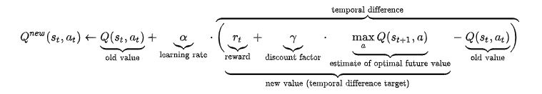

# {{ page.title }}

# Video Summary
<iframe width="854" height="480" src="https://www.youtube.com/embed/g1iRoPiDK_c" title="YouTube video player" frameborder="0" allow="accelerometer; autoplay; clipboard-write; encrypted-media; gyroscope; picture-in-picture" allowfullscreen></iframe>

# Summary of Project
Project Roomba's goal is to create an AI agent in Minecraft that is able to gain the most points by mining ore within the allotted time limit. Each ore will be assigned a point value based upon our scoring system. The AI should attempt to figure out the optimal path to take in order to obtain the highest score within the time given.

The AI will have the knowledge of its own position in the grid and each ore type's scoring point value. The AI agent will learn the world boundaries and ore positions.

We are using reinforcement learning and are comparing it to a simpler search algorithm. Without the time limit, this task would be a relatively simple path problem. However, because the agent is timed, the problem becomes one that the AI agent can solve better.

  

# Approaches
We tried one q-learning approach and two baselines, described below:

## Q-Learning Algorithm:

  

### Parameters:
For our problem, we found that the parameters that worked the best were when:
  
 alpha = 0.4

  
 epsilon = 0.05 

  
 gamma = 0.6 

We took a Epsilon-greedy approach for our reinforcement learning. This meant our AI would rarely take a random action and instead choose the action with the best score. Initally, epsilon was set to 0.01. However, we found that this led to more plateus. With the slight adjusment, our AI would do enough exploration to move past stagnant scores.

With higher values of alpha, our AI would learn quickly. However, because the AI can return to spots it has already mined, we found that higher values led the AI to priotize returning to those spots. This prevented the AI from scoring higher. 

We found that with higher values of gamma, our AI viewed future rewards more importantly than current ones. However, the AI had limited time to explore the map and collect the most amount of diamonds. This meant that occasionally it was beneficial for the AI to consider immediate rewards rather than future rewards. The value we settled on was a good medium. 

### Movement:
The AI's movement option set includes:
- move forward, back, left, and right
- turn left or right 90 degrees.

The AI automatically mines blocks that it observes right in front of it.

  

### State Space:
The state space is represented by a matrix, with each entry representing a block on the board. The AI learns the state space, figuring out which locations are lava and will kill it, and which locations are ores and will give it a reward.

### Rewards:
We give a positive reward for the AI picking up the ore after mining it. We also give negative rewards for falling into lava and performing actions. We give a small punishment for taking actions because we want the AI to work quickly. Having too many actions would lead to a poor score in a situation with a time limit.

## Baseline Algorithm 1: Random Action
Our first baseline algorithm performs random movements and turns, but it will mine blocks if it detects them in front of it. This was the bare minimum we wanted the q-learning algorithm to outperform.

## Baseline Algorithm 2: Breadth-First Search
Our second baseline algorithm knows the locations of all of the ores. It performs breadth first search to find the nearest ore, then takes that path to the ore. It then mines the ore and repeats. Because the BFS is done internally before the agent starts moving, it means that the agent will not wander around looking for the next ore. This approach's weakness is that it doesn't prioritize higher value ores because it only goes to the nearest ore.

# Evaluation

## Quantitative Evaluation
We wanted to investigate the performance of each algorithm in different scenarios. Specifically, we wanted to see the effect that the map and the time limit had on whether the Q-learning AI could outperform BFS.

We ran the baselines to obtain an average score value for each. Because the BFS algorithm does not perform random actions, its score is fixed for each map. We ran the random algorithm for a few dozen iterations before collecting the average. The random agent's results weren't very notable because it went out of bounds most of the time.

These averages are used to compare with the q-learning performance. We tested on two worlds:
- World A: good for q-learning (high scoring ores are far from spawn)
- World B: good for BFS (high scoring ores are close to spawn)

In these graphs, blue represents q-learning, green represents BFS, and yellow represents random.

  

This is the best case for our q-learning agent. It finds higher-scoring but further ores. The BFS agent ignores these in favor of closer low-scoring ones.

  

With a higher time limit, the BFS agent improves greatly because it has time to get to most of the high-scoring ores. The q-learning agent improves too, but not as dramatically.

  

The path the BFS agent takes is more or less optimal. It hits most of the highest scoring ores. The q-learning agent gets close at some points, but is forced to take random actions which lead it further away from the optimal path.

  

Again, the time increase helps the BFS agent more than the q-learning agent. Now the BFS agent hits pretty much every high scoring ore.

## Qualitiative Evaluation
We can qualitatively evaluate the AI by watching the route that it takes through the board. From this, we can get an idea of if the AI is taking a reasonable path by seeing if it moves towards nearby high-scoring ores. The video demo includes examples of the q-learning, random, and BFS runs.

# Resources Used
1. CS175 Assignment 2
2. tabular_q_learning Malmo example
3. https://microsoft.github.io/malmo/0.30.0/Schemas/Mission.html
4. https://minecraft.fandom.com/wiki