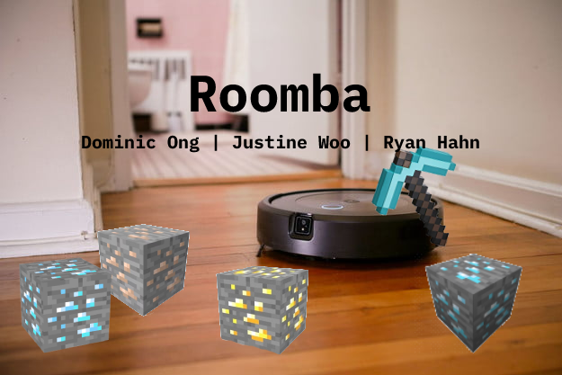

  

## About Roomba
Roomba is an AI built to clean up the ores on a Minecraft map. In this probject, our agent is placed on a board with various types of ores, each type with its own point value. The agent attempts to mine ores within a time limit such that the point value obtained is maximized. We trained our agent using the q-learning algorithm and evaluated it versus breadth first search approaches.

Reports:

- [Proposal](proposal.html)
- [Status](status.html)
- [Final](final.html)
- [Source Code](https://github.com/ingfong/Roomba)