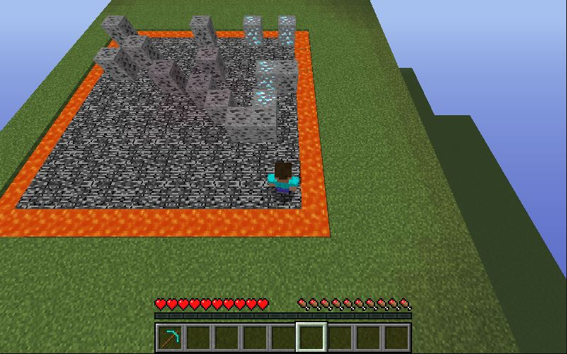
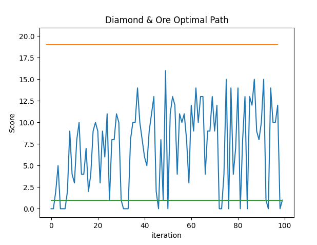

# {{ page.title }}

## Video Summary
<iframe width="854" height="480" src="https://www.youtube.com/embed/0GCA_a-loek" title="YouTube video player" frameborder="0" allow="accelerometer; autoplay; clipboard-write; encrypted-media; gyroscope; picture-in-picture" allowfullscreen></iframe>

## Summary of Project
Our project’s goal is to create an AI agent that is able to gain the most points by mining ore within the allotted time limit. Each ore will be assigned a point value based upon our scoring system. Based on the information provided, the AI should attempt to figure out the optimal path to take in order to obtain the highest score within the time allotted.

The AI agent will know the world boundaries through a grid system and the AI agent’s location relative to the system. The AI will also have the knowledge of each ore type's scoring point value.

We are using reinforcement learning to have our AI agent learn the most optimal path to maximize points from mining ores along the way.

  

## Approach
For this status report, we simplified the problem to evaluate the AI’s performance versus our reference approaches. Our AI resides in a smaller container that only has two types of ores: diamond and coal. The time limit is also very long, allowing the upper bound to easily mine all the ores.

The environment that the AI resides in is a square area with ores in various spots on top of the floor (not in the floor, but in the block layer above). The boundary of the plain is a ring of lava. The state of the map will only change when the AI mines ore.

### Algorithm:

  

### State Space:
The state space is represented by a matrix, with each entry representing a block on the board. The AI and ores’ location is stored in this matrix. The AI learns the state space, figuring out which locations are lava and will kill it, and which locations are ores and will give it a reward.

### Movement:
Since the project does not require the agent to account for movements on a Y axis (up and down), the AI’s movements can be simplified to  forwards, back, left and right. Thus, the path for the AI agent to reach an ore would boil down into different combinations of four movements. 

The agent can only mine the block in front of it, so we add 2 actions to it: turning left and right.

The AI will mine blocks that it observes in front of it. This is done automatically, and is not part of the movement set that the algorithm uses.

### Rewards:
Currently, we give a positive reward for the AI picking up the ore after mining it. We also give negative rewards for falling into lava and performing actions. We give a small punishment for taking actions because we want the AI to work quickly. Having too many actions would lead to a poor score in a situation with a time limit.

## Evaluation
We created two algorithms to use as reference for evaluation.

Our baseline algorithm performs random movements and turns, but it will mine blocks if it detects them in front of it.

Our upper bound algorithm knows the locations of all of the ores. It performs breadth first search to find the nearest ore, then takes that path to the ore. It then mines the ore and repeats. Because the breadth first search is done internally before the agent starts moving, it means that the agent will not wander around looking for the next ore. This approach works very well, but it doesn't prioritize higher value ores because it only goes to the nearest ore.

### Quantitative Evaluation
We ran the baseline and upper bound algorithms to obtain an average score value for each. These averages are used to compare with the q-learning performance. The following graph shows the performance of the q-learning agent over time versus the baseline and upper bound.

  

The orange and green lines represent the upper bound and baseline score averages, respectively. Note that the green line should actually show much greater variance because it takes random actions. We simplified it to a constant average representation because we ran it for fewer iterations and also to add all the data to the same graph.

When the tabular-q algorithm doesn’t fall in lava, which is most of the time, it much outperforms the baseline. However, it doesn’t get close to the upper bound, which easily mines all the ores on the board in time.

### Qualitiative Evaluation
We can qualitatively evaluate the AI by watching the route that it takes through the board. From this, we can get an idea of if the AI is taking a reasonable path by seeing if it moves towards nearby high-scoring ores. The video demo includes examples of the baseline, upper bound, and q-learning runs.

## Remaining Goals and Challenges
Further work for this project can be divided into two categories:

### Redefine the problem:
The problem that our algorithms currently solve is a simplified version of the desired problem. We would like our agent to work on larger boards with a variety of ore types. We also want to experiment with more time-crunch scenarios, because the time limit we've been using has been more than enough time for the upper bound to clear the entire board.

### Tweak the q-learning parameters:
We didn't have much time to experiment with as many combinations of constant values and reward values as we would like. We also didn't run the q-learning algorithm for that many iterations. Because of that, we feel like the algorithm could potentially improve greatly past how it is currently performing.

## Resources Used
1. CS175 Assignment 2
2. tabular_q_learning Malmo example
3. https://microsoft.github.io/malmo/0.30.0/Schemas/Mission.html
4. https://minecraft.fandom.com/wiki
