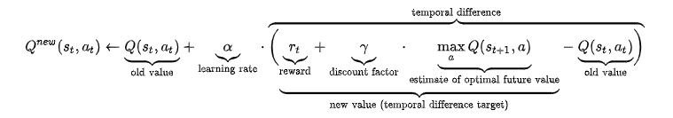

# {{ page.title }}

## Summary of Project
Our project’s goal is to create an AI agent that is able to gain the most points by mining ore within the allotted time limit. Each ore will be assigned a point value based upon our scoring system. Based on the information provided, the AI should attempt to figure out the optimal path to take in order to obtain the highest score within the time allotted.

The AI agent will know the world boundaries through a grid system and the AI agent’s location relative to the system. The AI will also have the knowledge of where each ore is located and its scoring point value.

We are using reinforcement learning to have our AI agent find the most optimal path to maximize points from mining ores along the way.

# TODO: Image of board

## Approach
For this status report, we simplified the problem because our group wants to check that the AI can successfully get as close as possible to our baseline (described in the Evaluation section). Our AI resides in a smaller container that only has two types of ores: diamond and coal. Our agent also currently does not keep track of the locations of the 
The environment that the AI resides in is a square area with ores in various spots on top of the floor (not in the floor, but in the block layer above). The boundary of the plain is a ring of lava. The state of the map will only change when the AI mines ore.

### Algorithm

  

### State Space
The state space is represented by a matrix, with each entry representing a block on the board. The AI and ores’ location is stored in this matrix. Because the AI agent already has knowledge of the entire grid system, there are two tasks the AI can fulfill: move towards an ore or mine an ore. However, the ore is mined, the AI must also be able to recognize that the ore needs to be retrieved after it has finished.

### Movement
The first part to focus on is the AI agent’s movement. Since the project does not require the agent to account for movements on a Y axis (up and down), the AI’s movements can be simplified to  forwards, back, left and right. Thus, the path for the AI agent to reach an ore would boil down into different combinations of four movements. 

Given that the AI is looking to optimize the path to mine a block, rotation would also need to be factored in. This adds on another 2 possible movements as the AI agent can only rotate 90 degrees with each move.

The AI will mine blocks that it observes in front of it.

### Rewards
Currently, we give a positive reward for the AI picking up the ore after mining it. We also give negative rewards for falling into lava and performing actions. We give a small punishment for taking actions because we want the AI to work quickly. Having too many actions would lead to a poor score in a situation with a time limit.

## Evaluation
We created two algorithms to use as reference for evaluation.

Our baseline algorithm performs random movements and turns, but it will mine blocks if it detects them in front of it.

Our upper bound algorithm knows the locations of all of the ores. It performs breadth first search to find the nearest ore, then takes that path to the ore. It then mines the ore and repeats. Because the breadth first search is done internally before the agent starts moving, it means that the agent will not wander around looking for the next ore. This approach works very well, but it doesn't prioritize higher value ores because it only goes to the nearest ore.

### Quantitative Evaluation
We ran the baseline and upper bound algorithms to obtain an average score value for each. These averages are used to compare with the q-learning performance. The following graph shows the performance of the q-learning agent over time versus the baseline and upper bound.

# TODO: Graph, then add some analysis

### Qualitiative Evaluation
We can qualitatively evaluate the AI by watching the route that it takes through the board. From this, we can get an idea of if the AI is taking a reasonable path by seeing if it moves towards nearby high-scoring ores. The video demo includes examples of the baseline, upper bound, and q-learning runs.

## Remaining Goals and Challenges
# TODO

## Resources Used
1. CS175 Assignment 2
2. tabular_q_learning Malmo example
3. https://microsoft.github.io/malmo/0.30.0/Schemas/Mission.html
4. https://minecraft.fandom.com/wiki
